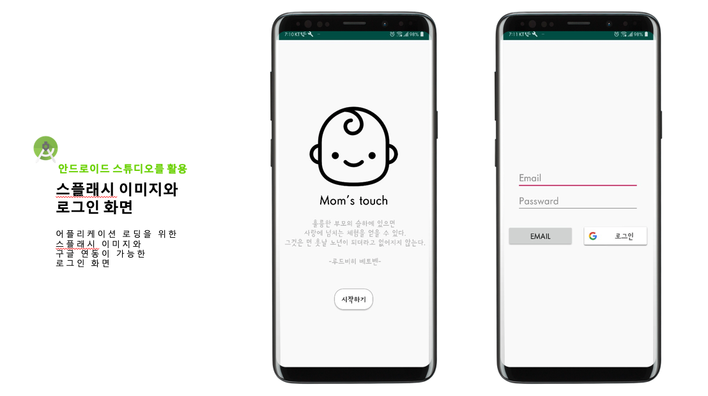
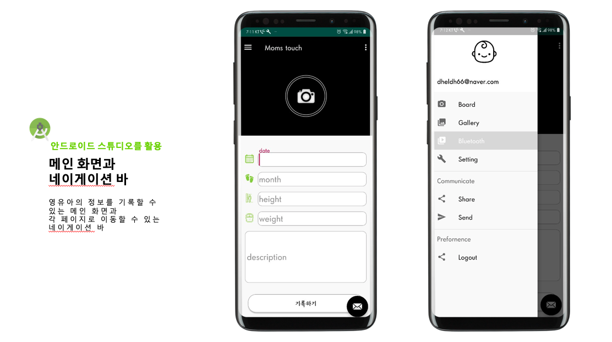
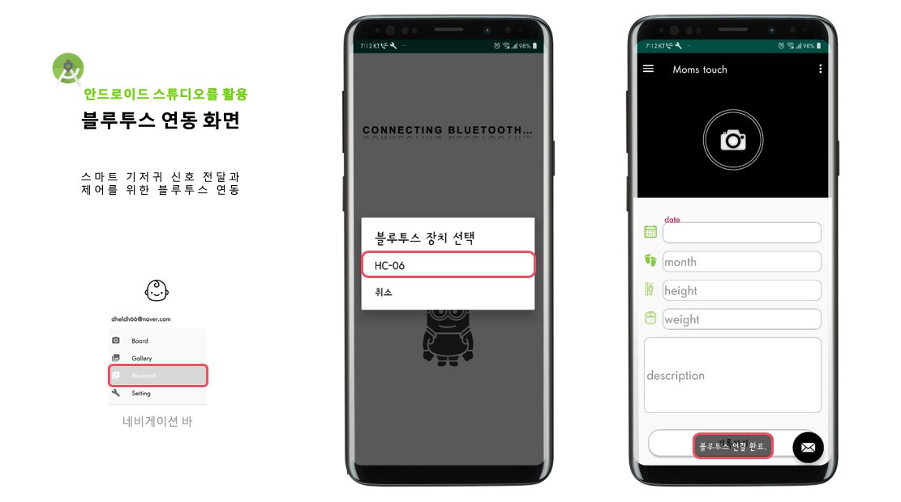
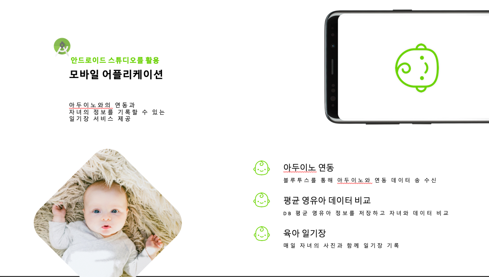
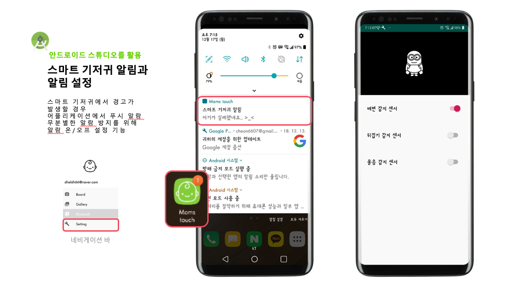
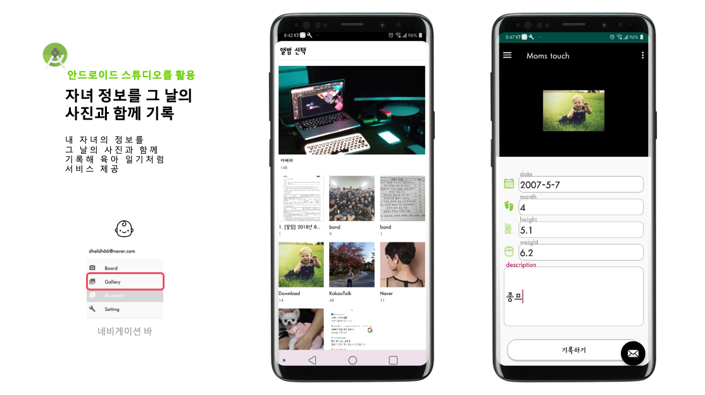
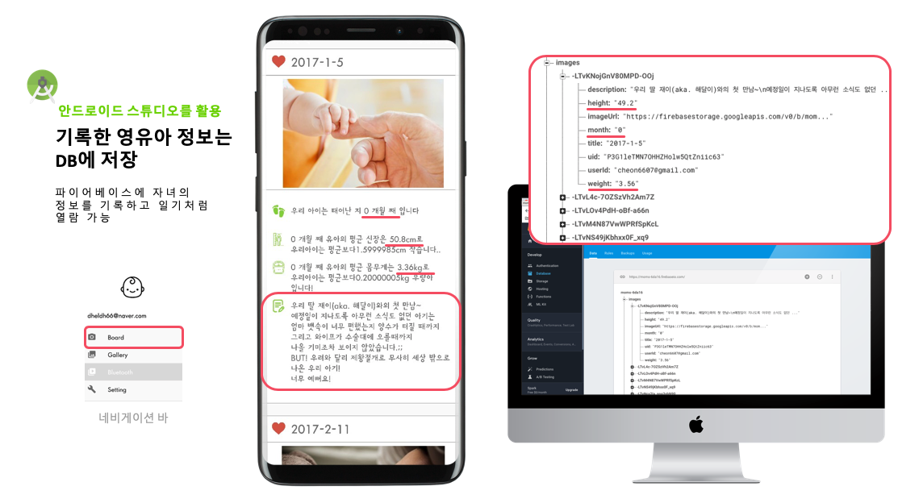
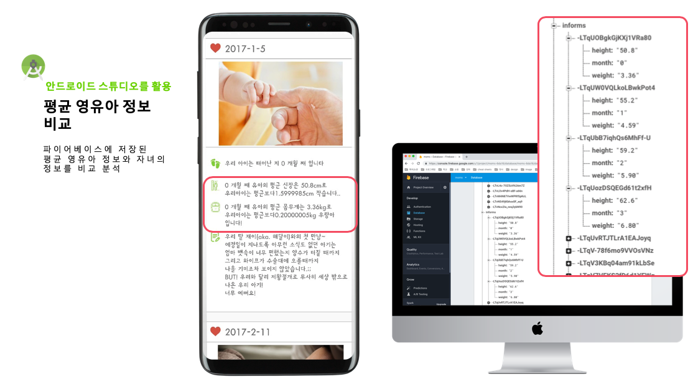

# mom2
https://youtu.be/EMIlz4w9OtI

<h2>1. 목표</h2>
 ◦스마트기저귀를 활용하여 맞벌이 부부의 육아 부담감을 최대한 줄일 수 있게 하는 것 
 
 -맞벌이 부부의 여가생활 보장
 
 -백색소음을 이용해 불면증 및 수면부족 해결
 
 -스마트폰과 기저귀를 연결시켜 편리한 육아 가능 

 ◦영유아 사망률 비율이 제일 높은 돌연사 증후군을 해결 하는 것

 ◦영유아 뿐만 아니라 치매노인, 장애인 등 허약계층도 사용 할 수 있도록 확대
 
<h2>2.아두이노 센서를 기저귀에 부착시켜 여러 가지 기능을 수행하게함</h2>

  -온습도 센서: 습도 센서를 통해 영유아의 배변 유무를 확인
  
  -기울기 센서: 영유아가 잘 때 뒤집어졌을 경우 알림을 울리도록 구성
  
  -녹음 센서: 영유아가 울음을 터트렸을 때 백색소음이 나오도록 구성 
  
  -큰소리 센서: 영유아의 울음소리를 잘 인식 할 수 있도록 구성
  
  -블루투스 센서: 스마트폰과 스마트 기저귀를 연결 할 때 통신에러가 없도록 구성

 ◦스마트 기저귀와 호환되는 앱 제작 
 
   -온습도 센서, 기울기 센서의 기준치를 정한 다음 기준치가 넘었을 시 앱에서 알림이 울리게 구성
   
   -앱의 여러 가지 기능 추가 (추억남기기, 영유아 비교, 알림설정 등) 
   
<h2>3.실행결과</h2>

